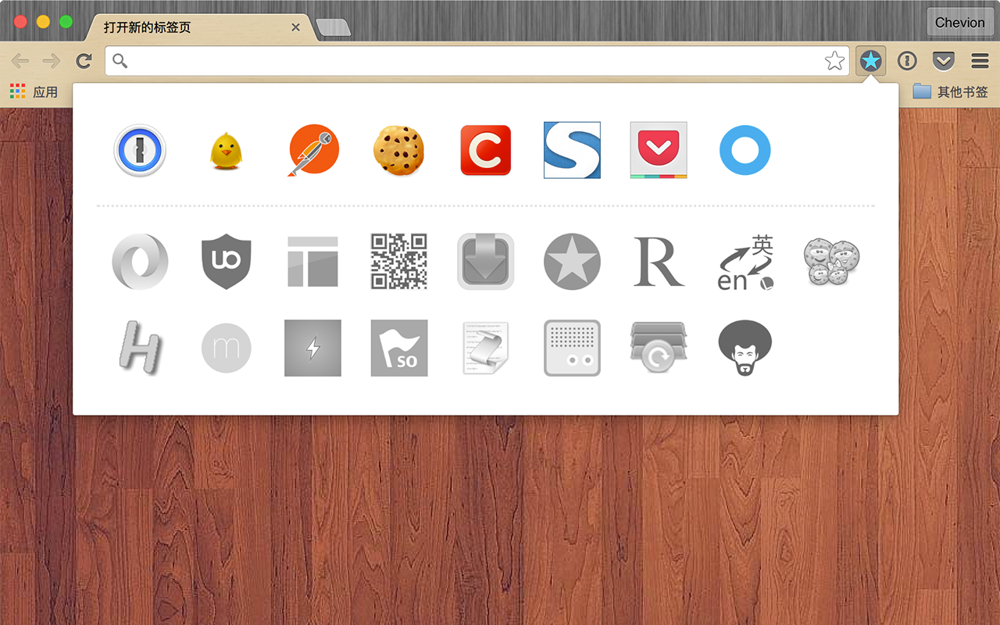
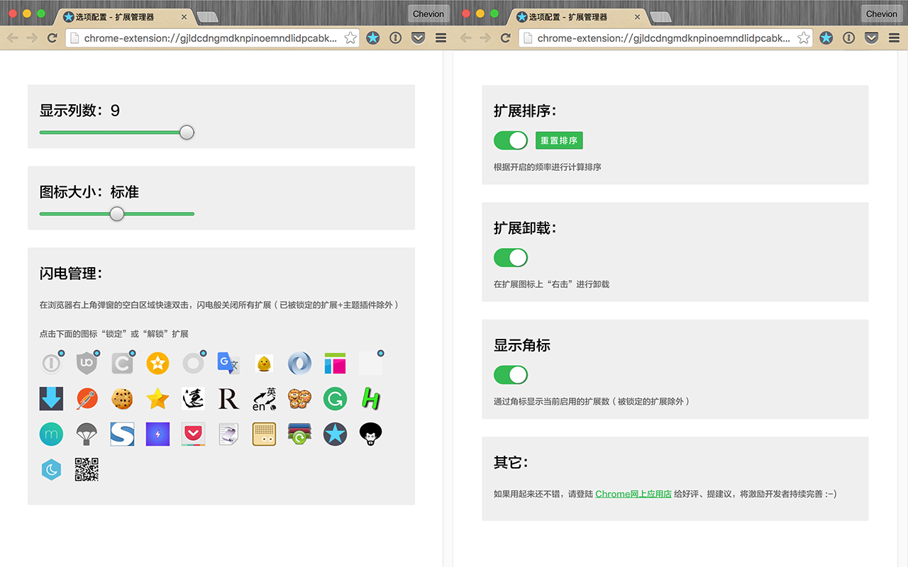

# Chrome浏览器扩展管理器

一键管理Chrome浏览器的扩展，操作简单方便，减少扩展对资源的占用及浪费，绿色安全。

* 操作简单快捷
* 安全无风险
* 提升浏览性能

## 功能

* 闪电管理
* 扩展排序
* 扩展卸载

## 使用

*`支持语言：English, 中文 (简体), 中文 (繁體), 日本語`*

> 从 [`Google网上应用店`](https://chrome.google.com/webstore/detail/%E6%89%A9%E5%B1%95%E7%AE%A1%E7%90%86%E5%99%A8%EF%BC%88extension-manager%EF%BC%89/gjldcdngmdknpinoemndlidpcabkggco) 下载

> 如果用起来还不错，请登陆 [`Google网上应用店`](https://chrome.google.com/webstore/detail/extension-manager/gjldcdngmdknpinoemndlidpcabkggco/reviews) 给好评、提建议，将激励开发者持续完善 :-)

## 预览

