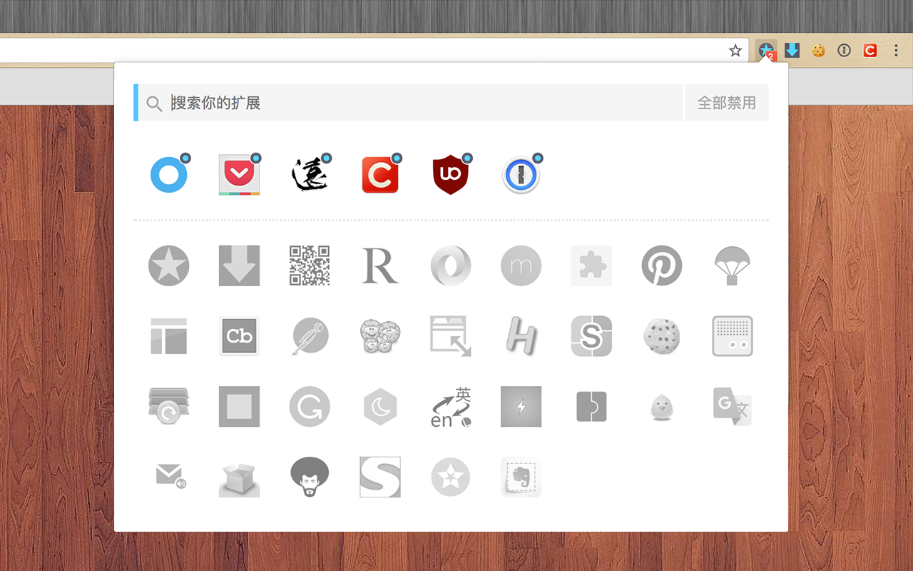
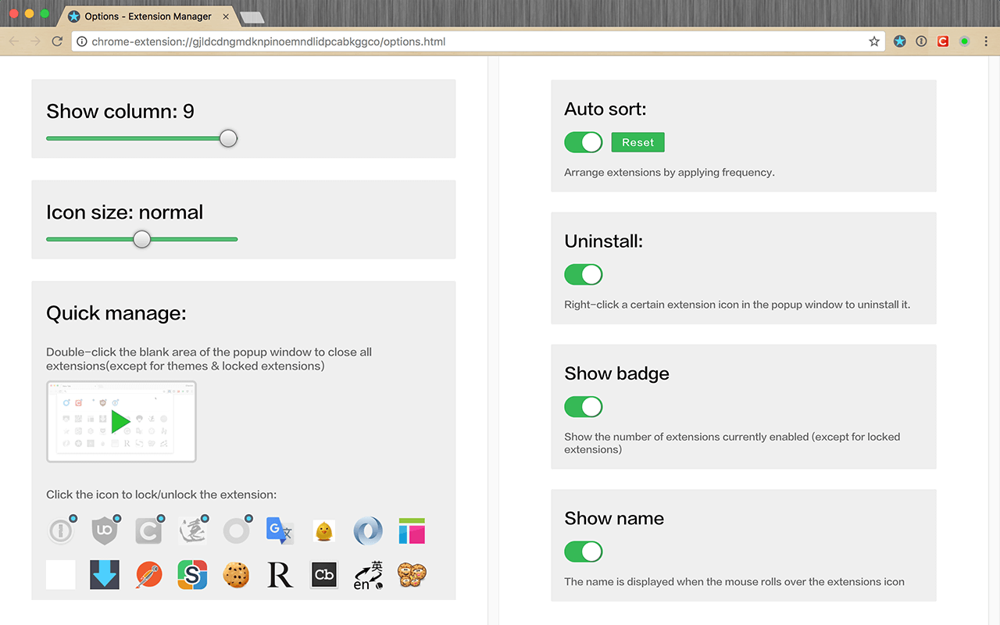
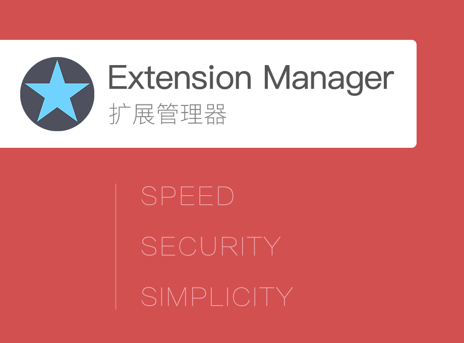

# Extension Manager (Chrome)

一键管理Chrome浏览器的扩展，操作简单方便，减少扩展对资源的占用及浪费，绿色安全。

* 操作简单快捷
* 安全无风险
* 提升浏览性能


## Feature

* 分组管理
* 扩展锁定
* 闪电操作
* 智能排序


## Explain

*`支持语言： English, 中文 (简体), 中文 (繁體), 日本語, русский`*

> 登陆 [`Google网上应用店`](https://chrome.google.com/webstore/detail/%E6%89%A9%E5%B1%95%E7%AE%A1%E7%90%86%E5%99%A8%EF%BC%88extension-manager%EF%BC%89/gjldcdngmdknpinoemndlidpcabkggco) 安装

> 如果用起来还不错，请登陆 [`Google网上应用店`](https://chrome.google.com/webstore/detail/extension-manager/gjldcdngmdknpinoemndlidpcabkggco/reviews) 给予好评 或 提供支持性建议，将激励开发者持续完善 :-)


## Preview









## Build Setup

``` bash
# install dependencies
npm install

# serve with hot reload at localhost:8080
npm run dev

# build for production with minification
npm run build
```
